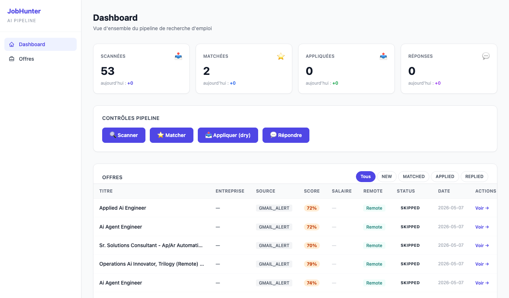
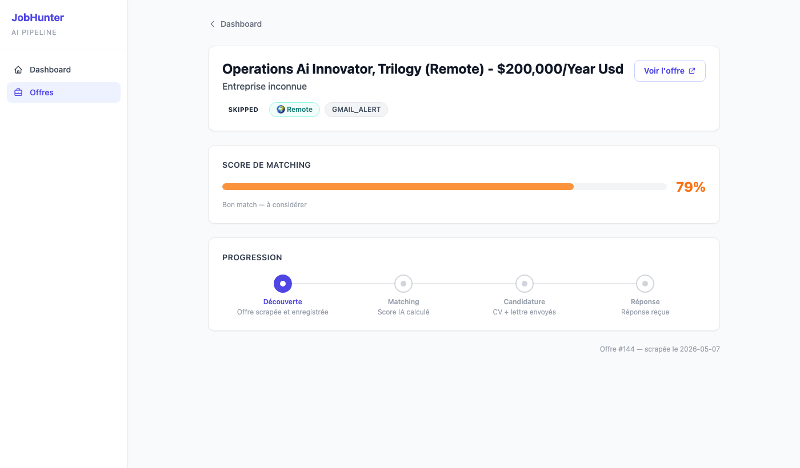

# JobHunter AI

[](https://python.org)
[](#tests)
[](https://jobhunter-ai-production-dd33.up.railway.app)
[](LICENSE)

Scrapes job boards, scores each offer with a 6-block LLM evaluation (A–F), generates a tailored CV and cover letter, then handles recruiter replies. The only human step is approving on Telegram before anything is sent.



*53 offers scanned, 2 matched above threshold — pipeline controls trigger each phase independently.*

---

## Live demo — no setup required

**→ [jobhunter-ai-production-dd33.up.railway.app](https://jobhunter-ai-production-dd33.up.railway.app)**

1. **Register** — create an account
2. **Settings → My Profile** — fill in name, title, experience, location, salary range
3. **Settings → Sources** — enable WTTJ, add keywords (e.g. `automation`, `python`), set location and work mode
4. **Settings → Credentials** — enter your OpenRouter API key (~$1 of credit is enough to start)
5. **Dashboard → Scan** — scrape job offers from active sources
6. **Dashboard → Match** — run LLM scoring — offers now show A–F blocks with percentages
7. Click any offer — see the full 6-block evaluation breakdown

> **Cheapest setup**: use [OpenRouter](https://openrouter.ai) with `openai/gpt-4o-mini` or `google/gemini-flash-1.5`. Set `LLM_PROVIDER=openrouter` and `LLM_MODEL=openai/gpt-4o-mini` in Settings.

---

## How scoring works

Each offer is evaluated across 6 blocks. The global score (0–100) is computed server-side from a weighted average — the LLM never outputs a number directly. That design choice prevents score drift: asking a model for "rate 0–100" produces inconsistent outputs; decomposing into structured classification prompts produces stable ones.

| Block | Weight | What it evaluates |
|-------|--------|-------------------|
| A — Role summary | 10% | Archetype detection, seniority, work arrangement |
| B — CV match | 25% | Matched requirements with evidence + gaps with severity |
| C — Level strategy | 15% | Seniority positioning, whether to push up or anchor |
| D — Compensation | 15% | PPP-adjusted salary fit |
| E — Personalization | 20% | Specific CV edits + cover letter angles for this offer |
| F — Interview prep | 15% | STAR story mapping, likely hard questions |

**Score formula**: `((weighted_avg_1–5 − 1.0) / 4.0) × 100`

Missing blocks default to 3.0 with a logged warning. Default threshold to proceed: ≥ 80.



---

## Pipeline phases

```
1. Scrape    → pull offers from WTTJ / Indeed / Gmail alerts / career pages
2. Filter    → dedup, basic keyword filter, source-specific exclusions
3. Match     → 6-block LLM evaluation → score 0–100
4. Research  → web-search company enrichment → Company model
5. Generate  → tailored CV (Jinja2 → WeasyPrint → PDF) + cover letter
6. Apply     → [Telegram gate] → submit, track thread in Gmail
```

---

## Sources

| Source | Notes |
|--------|-------|
| **WTTJ** | Playwright scraper, no API key needed |
| **Indeed** | JSearch API via RapidAPI (paid, ~$0/mo for low volume) |
| **Gmail alerts** | Parses job-alert emails → enriches via JSearch |
| **LinkedIn** | Playwright-stealth, disabled by default (ToS risk) |
| **Career pages** | Greenhouse REST + Ashby GraphQL direct integrations |
| **MCP bridge** | JSON batch importer — drop files in `data/mcp_inbox/` |

---

## Stack

Python 3.11+ · FastAPI · HTMX · SQLAlchemy 2 + Alembic · Playwright · Pydantic Settings · Typer · Jinja2 + WeasyPrint · Anthropic / OpenAI / Mistral / DeepSeek / OpenRouter

Deployed on **Railway** (PostgreSQL + web service, auto-deploy from main).

---

## Environment variables

| Variable | Required | Default | Notes |
|----------|----------|---------|-------|
| `JWT_SECRET` | ✅ | — | Min 32 chars, signs session tokens |
| `FERNET_KEY` | ✅ | — | Encrypts user API keys in DB |
| `DATABASE_URL` | — | `sqlite:///./jobhunter.db` | Postgres also supported |
| `LLM_PROVIDER` | — | `anthropic` | `anthropic` · `openai` · `mistral` · `deepseek` · `openrouter` |
| `LLM_MODEL` | — | provider default | Leave empty to use provider default |
| `LLM_SCORING_PROVIDER` | — | same as `LLM_PROVIDER` | Run scoring on a different (costlier) model |
| `LLM_SCORING_MODEL` | — | same as `LLM_MODEL` | e.g. `claude-sonnet-4-6` for scoring only |
| `ANTHROPIC_API_KEY` | if provider=anthropic | — | |
| `OPENAI_API_KEY` | if provider=openai | — | |
| `OPENROUTER_API_KEY` | if provider=openrouter | — | Access to 100+ models |
| `GMAIL_CLIENT_ID` | Gmail features | — | OAuth2 credentials |
| `GMAIL_CLIENT_SECRET` | Gmail features | — | |
| `GMAIL_REFRESH_TOKEN` | Gmail features | — | |
| `GMAIL_USER_EMAIL` | Gmail features | — | |
| `TELEGRAM_BOT_TOKEN` | apply phase | — | Required to gate submissions |
| `TELEGRAM_CHAT_ID` | apply phase | — | Your personal chat ID |
| `MIN_MATCH_SCORE` | — | `80` | Offers below this score are skipped |
| `MAX_APPLICATIONS_PER_DAY` | — | `10` | Hard cap |
| `DRY_RUN` | — | `true` | Set `false` only with Telegram gate configured |

---

## Self-hosting / Contributing

```bash
git clone https://github.com/MatthdV/jobhunter-ai.git
cd jobhunter-ai

python -m venv .venv && source .venv/bin/activate
pip install -e ".[dev]"

cp .env.example .env
# Required: JWT_SECRET, FERNET_KEY, LLM_PROVIDER + matching API key

alembic upgrade head
uvicorn src.api.app:app --reload   # http://localhost:8000
```

Generate keys:
```bash
python -c "import secrets; print(secrets.token_hex(32))"              # JWT_SECRET
python -c "from cryptography.fernet import Fernet; print(Fernet.generate_key().decode())"  # FERNET_KEY
```

---

## Architecture

```
src/
├── main.py                      # Typer CLI entry point
├── api/                         # FastAPI + HTMX dashboard
│   ├── routes/                  # pages, jobs, stats, pipeline, profile
│   ├── i18n.py                  # FR/EN/ES translation dicts
│   └── security.py              # Fernet encryption, JWT
├── config/
│   ├── settings.py              # Pydantic Settings — loads .env
│   ├── portals.yaml             # Career page portals (Greenhouse, Ashby)
│   └── stories.yaml             # STAR+R interview story bank
├── storage/
│   ├── models.py                # Job, Company, Application, MatchResult, User
│   └── database.py
├── scrapers/
│   ├── wttj_scraper.py
│   ├── indeed_scraper.py
│   ├── gmail_scraper.py
│   ├── career_pages.py          # Greenhouse REST + Ashby GraphQL
│   └── linkedin_scraper.py      # playwright-stealth, disabled by default
├── importers/
│   └── mcp_bridge.py            # Drains data/mcp_inbox/ JSON batches
├── matching/
│   ├── scorer.py                # 6-block A–F evaluator
│   └── archetypes.py
├── generators/
│   ├── cv_generator.py          # Jinja2 → WeasyPrint → PDF
│   └── cover_letter_generator.py
├── communications/
│   ├── email_handler.py         # Gmail API
│   ├── telegram_bot.py          # Approval gate + notifications
│   └── recruiter_responder.py
├── scheduler/
│   └── job_scheduler.py         # Full pipeline orchestration
└── llm/
    ├── base.py                  # Abstract LLMClient
    ├── factory.py               # Provider selection from settings
    ├── anthropic_client.py
    ├── openai_client.py
    ├── openrouter_client.py
    └── ...
```

---

## Tests

```bash
pytest                                               # all 493 tests
pytest tests/test_scorer_multibloc.py -v            # A–F scorer
pytest tests/test_scorer_deterministic_score.py -v
```

---

## Design notes

**Why the scorer never asks the LLM for a number.**
Early versions prompted the model with "rate this job 0–100." Outputs drifted — same offer scored 71 one run and 84 the next, with confident-sounding reasoning both times. Fix: decompose into structured classification prompts (matched requirement: yes/no, gap severity: low/medium/high) and compute the global score server-side from a fixed weighted formula. The LLM cannot hallucinate a number it is never asked to produce.

**Human-in-the-loop gate.** `TelegramBot.request_approval()` blocks before any submission. Cannot be bypassed — `apply --live` fails without a Telegram token, dry-run is the default.

**Profile as source of truth.** The per-user profile YAML (stored in DB, editable in Settings) drives scoring prompts, CV generation, keyword rotation, and country tiers. One config, everything updates.

**Provider-agnostic LLM layer.** Swap `LLM_PROVIDER` and nothing else changes. `LLM_SCORING_PROVIDER` lets you run scoring on a capable model while generation uses a cheaper one — cost awareness in config, not code.

---

## Author

**Matthieu de Villele** — Automation & AI Engineer  
[LinkedIn](https://www.linkedin.com/in/matthieudevillele/) · [GitHub](https://github.com/MatthdV)
