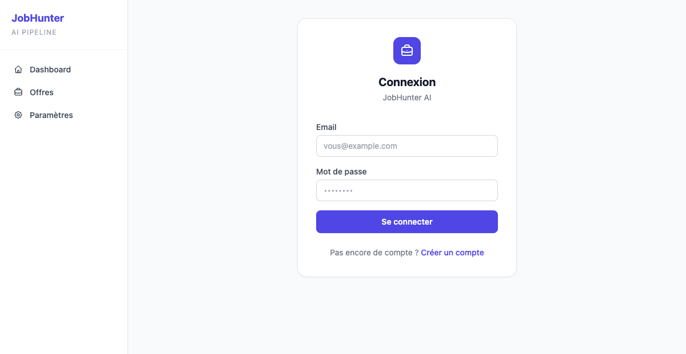
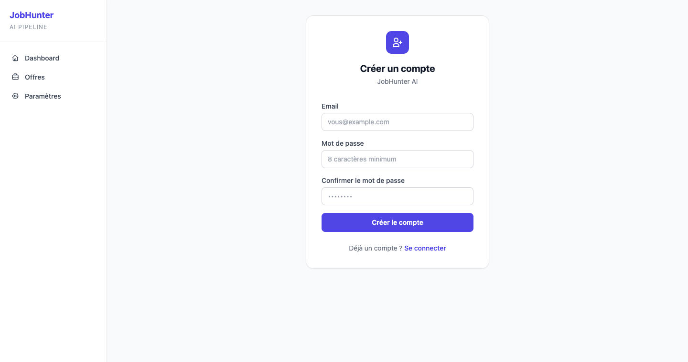
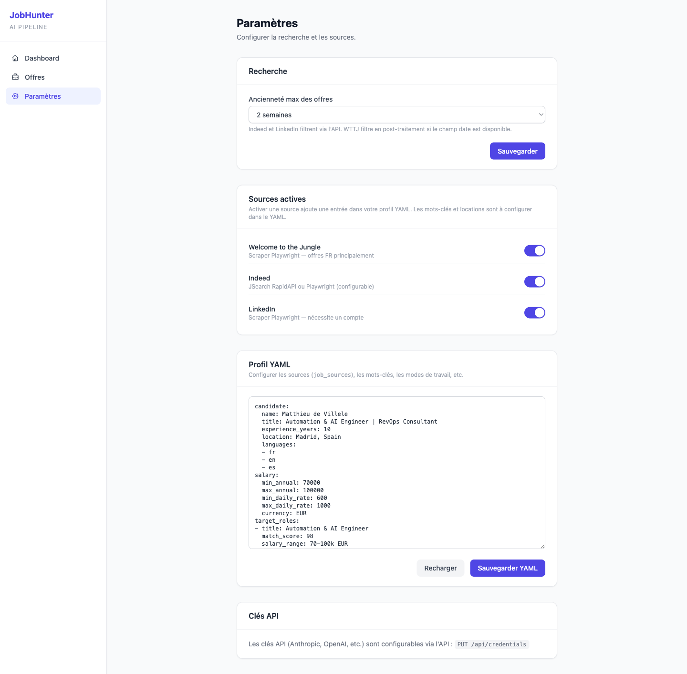
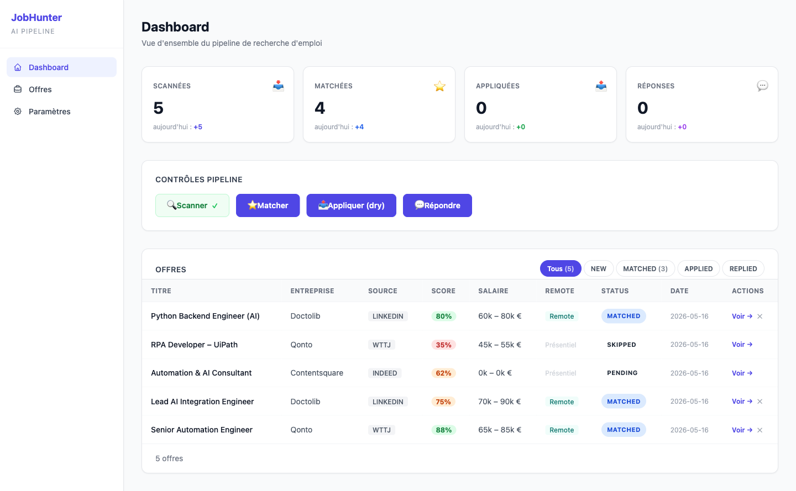
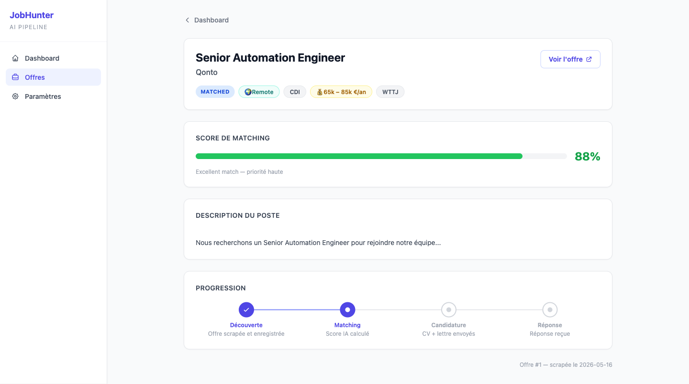

# JobHunter AI — Guide d'utilisation

> **JobHunter AI** scanne automatiquement les offres d'emploi sur Welcome to the Jungle, Indeed et LinkedIn, les filtre selon votre profil, et les présente avec un score de correspondance. Vous ne voyez que les offres qui valent vraiment votre temps.

---

## Table des matières

1. [Prérequis](#1-prérequis)
2. [Installation](#2-installation)
3. [Premier démarrage](#3-premier-démarrage)
4. [Créer votre compte](#4-créer-votre-compte)
5. [Configurer votre profil YAML](#5-configurer-votre-profil-yaml)
6. [Paramètres](#6-paramètres)
7. [Lancer une recherche](#7-lancer-une-recherche)
8. [Consulter les offres](#8-consulter-les-offres)
9. [Gérer une offre](#9-gérer-une-offre)
10. [Questions fréquentes](#10-questions-fréquentes)

---

## 1. Prérequis

Vous avez besoin de deux logiciels installés sur votre ordinateur :

| Logiciel | Où le télécharger | Pourquoi |
|----------|-------------------|---------|
| **Docker Desktop** | [docker.com/products/docker-desktop](https://www.docker.com/products/docker-desktop/) | Fait tourner l'application |
| **Git** | [git-scm.com](https://git-scm.com) | Télécharge le code source |

> **Pas sûr d'avoir Docker ?** Ouvrez un terminal et tapez `docker --version`. Si vous voyez un numéro de version, c'est installé.

---

## 2. Installation

### Étape 1 — Télécharger le projet

Ouvrez un terminal (sur Mac : `Cmd+Espace` → tapez "Terminal") et copiez-collez ces deux lignes :

```bash
git clone https://github.com/VOTRE-REPO/jobhunter-ai.git
cd jobhunter-ai
```

### Étape 2 — Créer le fichier de configuration

```bash
cp .env.example .env
```

Ouvrez le fichier `.env` avec un éditeur de texte (Bloc-notes, TextEdit, etc.) et renseignez au minimum :

```
SECRET_KEY=une-longue-phrase-secrete-au-hasard-ici
FERNET_KEY=
```

> **Comment générer FERNET_KEY ?** Dans votre terminal :
> ```bash
> python3 -c "from cryptography.fernet import Fernet; print(Fernet.generate_key().decode())"
> ```
> Copiez le résultat et collez-le après `FERNET_KEY=`

### Étape 3 — Démarrer l'application

```bash
docker compose up -d
```

Patientez 30 secondes, puis ouvrez votre navigateur à l'adresse :
**http://localhost:8000**

---

## 3. Premier démarrage

Quand vous ouvrez http://localhost:8000 pour la première fois, vous arrivez sur la page de connexion.



Puisque vous n'avez pas encore de compte, cliquez sur **"Créer un compte"**.

---

## 4. Créer votre compte



Renseignez :
- **Email** : votre adresse email (sert d'identifiant)
- **Mot de passe** : au moins 8 caractères
- **Confirmer le mot de passe** : répétez le même

Cliquez **"Créer mon compte"**. Vous êtes automatiquement connecté et redirigé vers le dashboard.

---

## 5. Configurer votre profil YAML

C'est l'étape la plus importante. Le profil YAML indique à JobHunter AI **quoi chercher** et **où chercher**.

Allez dans **Paramètres** (icône engrenage dans le menu gauche) → section **Profil YAML**.

### Exemple de profil minimal

```yaml
job_sources:
  - name: wttj
    enabled: true
    search_terms:
      - automation engineer
      - python developer
    location: Paris
    countries:
      - FR
    work_modes:
      - remote
      - hybrid
    auto_translate: true
```

### Explication de chaque champ

| Champ | Ce que ça fait | Exemple |
|-------|---------------|---------|
| `name` | La source à utiliser | `wttj`, `indeed`, `linkedin` |
| `enabled` | Activer ou désactiver cette source | `true` ou `false` |
| `search_terms` | Les mots-clés de recherche | `automation engineer` |
| `location` | La ville ou région ciblée | `Paris`, `London`, `Remote` |
| `countries` | Les pays ciblés (code ISO) | `FR`, `GB`, `DE` |
| `work_modes` | Modes de travail acceptés | `remote`, `hybrid`, `on-site` |
| `auto_translate` | Traduit les mots-clés selon la langue du pays | `true` ou `false` |

### Exemple multi-sources et multi-villes

```yaml
job_sources:
  # WTTJ — Paris, Full remote
  - name: wttj
    enabled: true
    search_terms:
      - automation engineer
      - ai integration
    location: Paris
    countries:
      - FR
    work_modes:
      - remote
      - hybrid
    auto_translate: true

  # Indeed — Londres, recherche en anglais
  - name: indeed
    enabled: true
    search_terms:
      - automation engineer
      - python developer
    location: London
    countries:
      - GB
    work_modes:
      - remote
    auto_translate: false

  # LinkedIn — Full remote partout
  - name: linkedin
    enabled: true
    search_terms:
      - automation engineer
    location: Remote
    countries:
      - FR
    work_modes:
      - remote
    auto_translate: false
```

> **Astuce** : `auto_translate: true` avec `countries: [FR]` traduit automatiquement "automation engineer" en "ingénieur automatisation" pour élargir les résultats français.

---

## 6. Paramètres



La page Paramètres contient quatre sections :

### Sources actives

Activez ou désactivez rapidement chaque source avec les boutons bascule (toggle). Un toggle **bleu** = source active. Activer une source qui n'est pas dans votre YAML l'y ajoute automatiquement avec des valeurs par défaut.

### Ancienneté des offres

Choisissez jusqu'à quel point remonter dans les offres :
- **Aujourd'hui** — uniquement les offres du jour
- **3 jours / 7 jours / 2 semaines** — selon votre fréquence de recherche
- **30 jours** (défaut) — bonne option pour le premier scan
- **Tout** — aucun filtre de date

Cliquez **"Sauvegarder"** après votre choix.

### Profil YAML

Éditeur de texte pour modifier directement votre configuration (voir section 5). Boutons **Sauvegarder YAML** et **Recharger**.

### Clés API

Entrez vos clés API pour les services que vous utilisez. Les champs avec un **point vert** indiquent une clé déjà enregistrée. Les valeurs sont chiffrées en base de données.

| Clé | Pourquoi l'avoir |
|-----|-----------------|
| **Anthropic** | Scoring IA des offres (recommandé) |
| **OpenAI** | Alternative au scoring IA |
| **Indeed API (JSearch)** | Accès API Indeed sans scraping |
| **LinkedIn email/password** | Scraping LinkedIn (compte requis) |
| **Telegram token/chat ID** | Notifications Telegram |

---

## 7. Lancer une recherche

Le pipeline se lance depuis le **Dashboard** (page d'accueil).



### Les étapes du pipeline

Le dashboard affiche les phases de recherche disponibles :

| Phase | Ce qui se passe |
|-------|----------------|
| **Scan** | Parcourt les sources (WTTJ, Indeed, LinkedIn) et collecte les offres brutes |
| **Match** | L'IA compare chaque offre à votre profil et attribue un score de 0 à 100 |
| **Apply** | *(optionnel)* Génère des lettres de motivation et soumet les candidatures |

### Lancer un scan

Cliquez sur le bouton **"Run"** à côté de **Scan**. Une barre de progression apparaît. La durée dépend du nombre de sources et de mots-clés (généralement 2 à 10 minutes).

> **Premier scan lent ?** C'est normal — Playwright télécharge les pages web en temps réel. Les scans suivants utilisent le cache et vont plus vite.

### Après le scan

Les compteurs en haut du dashboard se mettent à jour :
- **Scannées** : nombre total d'offres collectées
- **Matchées** : offres avec un score suffisant
- **Aujourd'hui** : offres trouvées lors du dernier scan

---

## 8. Consulter les offres


### Filtres par statut

En haut de la liste, des onglets permettent de filtrer :

| Onglet | Signification |
|--------|--------------|
| **Toutes** | Toutes les offres collectées |
| **Matched** | Offres validées par l'IA (score > seuil) |
| **Pending** | En attente de décision manuelle |
| **Skipped** | Offres rejetées (score insuffisant ou rejetées manuellement) |
| **Applied** | Candidatures envoyées |

### Comprendre le score

Chaque offre affiche un **score de 0 à 100** :
- **80-100** : Excellente correspondance — à traiter en priorité
- **60-79** : Bonne correspondance — mérite d'être regardée
- **40-59** : Correspondance partielle — à évaluer selon contexte
- **0-39** : Faible correspondance — généralement ignoré automatiquement

Le score tient compte de : vos mots-clés, le type de contrat, la localisation, le salaire, et l'analyse sémantique de la description.

---

## 9. Gérer une offre

Cliquez sur n'importe quelle offre de la liste pour voir le détail.



### Ce que vous voyez

- **Titre, entreprise, localisation, salaire** — infos de base
- **Score et raisonnement** — l'IA explique pourquoi ce score
- **Description complète** — le texte original de l'offre
- **Blocs d'évaluation A-F** — analyse détaillée si le matching IA a tourné

### Actions disponibles

Depuis la liste des offres, deux boutons rapides :
- **✓ (Accept)** — passe l'offre en statut "Matched" / candidature
- **✗ (Skip)** — passe l'offre en statut "Skipped"

Ces boutons mettent à jour le statut sans recharger la page.

---

## 10. Questions fréquentes

**L'application ne démarre pas — que faire ?**
Vérifiez que Docker Desktop est bien lancé (icône baleine dans la barre des tâches). Puis dans le terminal : `docker compose logs jobhunter-web` pour voir les erreurs.

**Le scan tourne mais ne trouve rien ?**
Vérifiez votre profil YAML : les `search_terms` doivent être non vides, et la source doit avoir `enabled: true`. Vérifiez aussi les toggles dans Paramètres → Sources actives.

**LinkedIn ne fonctionne pas ?**
LinkedIn nécessite un compte valide. Entrez votre email et mot de passe LinkedIn dans Paramètres → Clés API. Assurez-vous que votre compte n'a pas de vérification 2FA active sur les nouvelles connexions.

**Comment changer le seuil de score minimum ?**
Dans votre profil YAML, ajoutez `min_match_score: 60` (valeur entre 0 et 100) à la racine du fichier.

**Les offres ne se mettent pas à jour automatiquement ?**
Le conteneur `jobhunter-cron` lance un scan automatique selon la configuration. Vérifiez qu'il tourne : `docker ps | grep cron`. Pour le désactiver, commentez les lignes dans `cron/jobhunter-cron`.

**Comment sauvegarder mes données ?**
Les données sont dans le volume Docker `db_data`. Pour faire une copie :
```bash
docker run --rm -v jobhunter-ai_db_data:/data -v $(pwd):/backup alpine tar czf /backup/jobhunter-backup.tar.gz /data
```

**Comment mettre à jour vers une nouvelle version ?**
```bash
git pull
docker compose build --no-cache
docker compose up -d --force-recreate
```

---

*Pour signaler un bug ou proposer une amélioration : ouvrez une issue sur le dépôt GitHub.*
